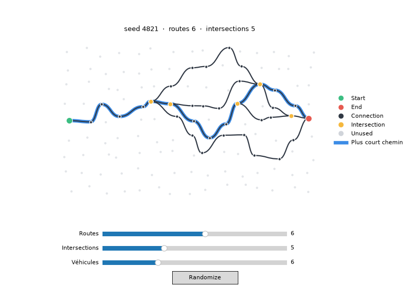
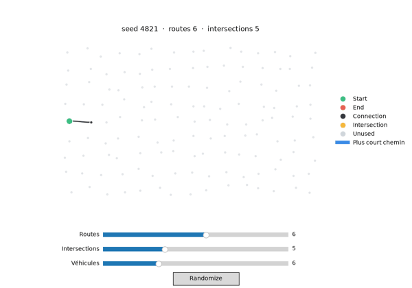

# RoadNetwork

Générateur procédural de réseau routier sur une grille, avec animation de routes et circulation de véhicules.
Projet du Bootcamp Python B3 – Sup de Vinci 2026-2027.



## Installation

Prérequis : Python 3.14.

```bash
# macOS / Linux
python3 -m venv .venv
./.venv/bin/python -m pip install -r requirements.txt

# Windows PowerShell
python -m venv .venv
.\.venv\Scripts\python.exe -m pip install -r requirements.txt
```

## Lancement

```bash
./.venv/bin/python main.py          # macOS / Linux
.\.venv\Scripts\python.exe main.py  # Windows
```

La fenêtre propose des curseurs pour régler le nombre de routes, le nombre d'intersections visé et le nombre de véhicules. Clique **Randomize** pour changer de réseau. Les véhicules parcourent les routes ; à chaque intersection, ils prennent une autre sortie que le dernier véhicule passé dans les 2 secondes, si une autre sortie existe.

La seed apparaît dans le titre et le terminal. Pour rejouer un réseau, mettre `SEED = 4821` dans `main.py`.

Les intersections sont un nombre **visé** : si la combinaison taille de grille / nombre de routes ne permet pas le nombre demandé, le titre indique le nombre obtenu et le nombre demandé. La génération cherche le meilleur réseau après un nombre limité d'essais.

## Réglages par défaut (`main.py`)

| Constante | Valeur | Rôle |
|---|---:|---|
| `COLUMNS`, `ROWS` | 15, 9 | taille de la grille |
| `SEED` | `None` | au hasard ; un entier rejoue le même réseau |
| `ROADS` | 4 | nombre de chemins (principal inclus) |
| `INTERSECTIONS` | 4 | intersections visées |
| `VEHICLES` | 6 | véhicules |

Réglages avancés dans `display.py` : `SPEED`, `SPAWN_DELAY`, `DIVERGE_WINDOW` dans `traffic.py` ; `CURVED_ROADS`, `CURVE_STRENGTH`, `FRAME_INTERVAL` dans `display.py`.

## Vérifications (QA)

```bash
./.venv/bin/python -m pip install -r requirements-dev.txt   # une fois : pytest + ruff
./run_checks.sh                                             # style + tests + check.py
```

| Outil | Ce qu'il vérifie |
|---|---|
| `ruff` | style, imports, noms, bugs courants (config dans `pyproject.toml`) |
| `pytest` (`test_roadnetwork.py`, 68 tests) | une règle du projet = un test : START/END, toutes les routes vont au END, pas de croisement en X, types, doublons, même seed = même réseau, cas limites (grille 2×1, 0 et 10 routes), grille invalide = message clair, divergence des véhicules |
| `check.py` | balayage de 120 réseaux (4 tailles × 30 seeds) |

Grille invalide (`COLUMNS < 2` ou `ROWS < 1`) : le programme affiche un message clair au lieu de planter.

## Fonctionnalités

- Graphe de nodes et segments, cinq types de node.
- Chemin principal et nombre réglable de routes secondaires.
- Nombre d'intersections visé réglable ; génération cherche une solution proche.
- Seed reproductible, Randomize.
- Construction animée, routes courbes et légende.
- Aspect organique : chaque node est légèrement décalé à l'écran (`JITTER` dans `display.py`), même seed = même forme. Le modèle reste une grille, donc les règles et les tests ne changent pas.
- Toutes les routes rejoignent le END (aucun cul-de-sac).
- Animation optimisée (blitting : seuls les véhicules sont redessinés).
- Plus court chemin START → END (BFS), surligné en bleu.
- Nombre réglable de véhicules, départs espacés.
- Règle de divergence : à une intersection, éviter la sortie choisie par un autre véhicule dans les 2 dernières secondes, si une autre sortie est disponible.



## Architecture

| Fichier | Responsabilité |
|---|---|
| `models.py` | NodeType, Node, Segment |
| `network.py` | grille, liens, plus court chemin |
| `generator.py` | construction du réseau et branches |
| `traffic.py` | véhicules, mouvement, décisions de sortie |
| `display.py` | fenêtre, curseurs, dessin et animation |
| `main.py` | point d'entrée et réglages par défaut |
| `check.py` | vérifications automatiques (balayage) |
| `test_roadnetwork.py` | tests pytest, une règle = un test |
| `run_checks.sh` | QA en une commande |

Voir [docs/architecture.md](docs/architecture.md) et [docs/](docs/README.md).

## Équipe

| Membre | Contribution |
|---|---|
| Yusuf | _à compléter_ |
| _à compléter_ | _à compléter_ |
| _à compléter_ | _à compléter_ |

## Sources et outils

- Support de cours « Bootcamp Python B3 » – Alexandre Coirier.
- Matplotlib : animation, widgets, tracés et patches.
- Assistance IA utilisée et code relu par l'équipe.
