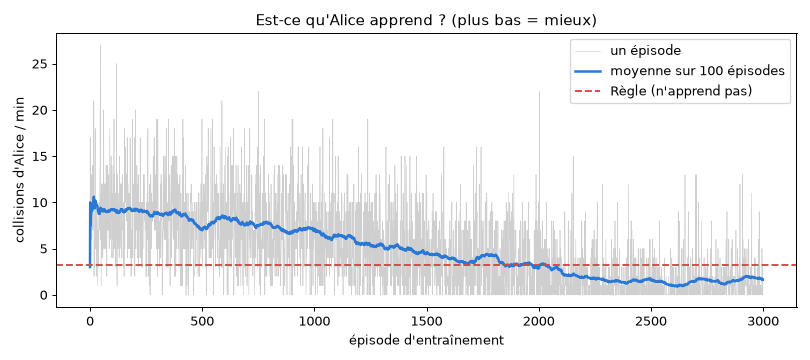

# Expérience Alice : du Machine Learning sur UNE seule voiture

> Objectif : **comprendre** le ML en voyant une différence de comportement.
> Alice (voiture n°0) change de conduite, les autres gardent la Règle. On compare.

## 0. Lancer (dans l'ordre)

```bash
.venv/bin/python -m pip install -r requirements.txt   # ajoute scikit-learn
.venv/bin/python tree_model.py      # 1. collecte + entraîne l'arbre (~25 s)
.venv/bin/python alice.py           # 2. entraîne le RL d'Alice + compare les 4 conduites (~30 s)
.venv/bin/python main.py            # 3. regarde Alice rouler (contour noir, « Alice* »)
```

Dans `main.py` : `ALICE = "rl"`, `"tree"` ou `None`.

---

## 1. Le vocabulaire (à savoir par cœur)

| Mot | Sens simple | Dans notre projet |
|---|---|---|
| **Modèle** | une « fonction » qui a appris à partir d'exemples | l'arbre, ou la table Q |
| **Feature** (X) | une information donnée au modèle | « la sortie tout droit est dangereuse ? » |
| **Label** (y) | la bonne réponse, connue pour les exemples | « collision : oui (1) / non (0) » |
| **Entraîner** | le modèle règle ses paramètres sur les exemples | `model.fit(X, y)` |
| **Prédire** | le modèle répond sur un cas nouveau | `model.predict_proba(X)` |
| **Jeu de test** | exemples cachés pendant l'entraînement, pour noter le modèle | 20 % des décisions |
| **Surapprentissage** | le modèle apprend par cœur, marche mal sur du neuf | on limite la profondeur à 4 |
| **Politique** | règle qui dit quoi faire dans chaque situation | `choose()` → (sortie, allure) |

## 2. Deux familles de ML

| | **Supervisé** (arbre) | **Par renforcement** (RL, Q-learning) |
|---|---|---|
| Analogie | apprendre avec un livre de corrigés | apprendre à faire du vélo en tombant |
| A besoin de | exemples + bonnes réponses | un environnement + des récompenses |
| Apprend | « cette action est-elle risquée **maintenant** ? » | « cette action rapporte quoi **au total**, futur compris ? » |
| Fichier | `tree_model.py` | `learning.py` (agent) + `alice.py` (entraînement Alice) |

---

## 3. Ce que « voit » Alice (les features)

À chaque node, avant de choisir, Alice regarde (fonction `get_state` de `learning.py`) :

| Feature | Valeurs | Sens |
|---|---|---|
| `descendre`, `tout_droit`, `monter` | 0 pas de sortie · 1 libre · 2 occupée (loin) · 3 **danger** | l'état de chaque sortie |
| `rapide` | 0 / 1 | Alice roule plus vite que la moyenne ? |
| `derriere` | 0 / 1 | quelqu'un arrive juste derrière elle ? |
| `direction` | 0 descendre · 1 tout droit · 2 monter | ce qu'elle **choisit** |
| `allure` | 0 lent · 1 normal · 2 rapide | ce qu'elle **choisit** |

Exemple de ligne dans `data/decisions.csv` :
```
descendre,tout_droit,monter,rapide,derriere,direction,allure,collision
1,3,0,1,0,1,2,1
```
→ « descendre libre, tout droit DANGER, pas de montée, je suis rapide, personne derrière ; j'ai pris **tout droit en rapide** → **collision** ». Logique.

---

## 4. Supervisé : l'arbre de décision (`tree_model.py`)

### Étape 1 : collecter
`RecorderPolicy` fait conduire tout le monde **au hasard** (pour voir toutes les situations) et note chaque décision :
- à la décision : on ouvre une ligne avec label 0 ;
- si une collision arrive avant la décision suivante : label → 1 ;
- à la décision suivante : la ligne est rangée.

150 circuits × 60 s → **~97 000 décisions**, dont **~18 % de collisions**.

### Étape 2 : entraîner
```python
x_train, x_test, y_train, y_test = train_test_split(x, y, test_size=0.2, stratify=y)
model = DecisionTreeClassifier(max_depth=4, class_weight="balanced")
model.fit(x_train, y_train)
```
- **`train_test_split`** : 80 % pour apprendre, 20 % cachés pour noter.
- **`max_depth=4`** : 4 questions max → l'arbre reste lisible (`docs/images/arbre.png`, `docs/arbre.txt`).
- **`class_weight="balanced"`** : voir piège n°1.

Un arbre, c'est une suite de questions. Extrait de `docs/arbre.txt` :
```
|--- derriere <= 0.50                  (personne derrière ?)
|   |--- tout_droit <= 1.50            (tout droit libre ou absent ?)
|   |   |--- monter <= 1.50
|   |   |   |--- descendre <= 1.50  -> class: 0   (tout est libre : OK)
```

### Étape 3 : utiliser (`TreePolicy`)
Pour chaque action possible (≤ 9), l'arbre donne une **probabilité de collision**. Alice prend l'action au plus petit `risque + petit malus si lent` (sinon elle roulerait lentement partout).

### Les résultats (lancer `tree_model.py` pour les voir)
| Mesure | Valeur | Lecture |
|---|---|---|
| Précision modèle « bête » (répond toujours « pas de collision ») | 82,2 % | le piège ! |
| Précision de l'arbre | 73,5 % | plus bas… |
| Collisions détectées (rappel) | 78,1 % | …mais il repère 3 collisions sur 4, le « bête » 0 |
| Précision sur l'entraînement | 73,8 % | ≈ test → **pas de surapprentissage** |

### ⚠️ Piège n°1 : la précision ment quand une classe est rare
82 % des décisions sont sans collision. Un modèle qui dit toujours « pas de collision » a 82 % de précision… et ne sert à rien. C'est pour ça qu'on regarde le **rappel** (part des collisions détectées) et qu'on met `class_weight="balanced"` (une erreur sur une collision coûte plus cher).

---

## 5. Renforcement : le Q-learning d'Alice (`alice.py`)

Pas d'exemples : Alice **essaie**, reçoit des **récompenses**, et retient.

| Événement | Récompense |
|---|---|
| collision | −10 |
| fin d'un cadre | +1 |
| chaque seconde de route | −0,1 (sinon rouler lentement serait gratuit) |

Elle tient une table `q[état][action]` = « combien ça rapporte ». Après chaque segment :
```
q = q + 0.1 × (récompense + 0.9 × meilleur q de la situation suivante − q)
         ↑ ALPHA : vitesse d'apprentissage      ↑ GAMMA : poids du futur
```
**Exploration** : au début Alice choisit au hasard (epsilon = 1), puis de moins en moins (epsilon → 0,05). Sans exploration, elle ne découvrirait jamais les bonnes actions.

3000 épisodes (~2 min). Seule Alice apprend, les 9 autres roulent à la Règle. Table → `q_alice.json` (lisible).

---

## 6. Les distances : un tronçon long prend plus de temps (toutes les voitures)

**Problème observé** : Alice choisissait presque toujours « rapide ». Normal : elle ne voyait pas la route. Tous les tronçons duraient pareil, qu'ils soient courts ou longs.

**Correction** (pour **toutes** les voitures : mêmes règles physiques, seule Alice apprend) :
- Vitesse de base générale, identique pour tous.
- Temps sur un tronçon = longueur / vitesse. Dans le code : `progress += speed × dt / length`.
- Longueur = longueur **réelle à l'écran** (`Circuit.get_length`) : l'extérieur de l'arc est plus long que l'intérieur, une diagonale plus longue qu'un tout droit. Entre 0,9 et 2,0 cases.
- Alice **voit** la longueur de chaque sortie : 3 features de plus (`long_descendre`, `long_tout_droit`, `long_monter`), valeurs 0 pas de sortie · 1 court (< 1,15) · 2 moyen (< 1,45) · 3 long.
  - RL : `AliceAgent` (état de 8 nombres au lieu de 5).
  - Arbre : 10 features au lieu de 7.

**Observabilité** : chaque voiture compte ses allures (`pace_counts`) et sa distance.
- À l'écran : sous le classement, l'allure actuelle d'Alice, la longueur du tronçon et la répartition lent / normal / rapide.
- Dans le terminal : `alice.py` affiche la répartition des allures pour chaque conduite.

## 7. Le carburant : rouler vite doit coûter quelque chose

**Problème observé** (grâce au compteur d'allures) : Alice roulait à 90-100 % en « rapide ». Rien ne l'en empêchait.

**Correction** : un carburant, pour **toutes** les voitures (même règle pour tous). Seule Alice en tient compte pour décider : les autres gardent la Règle, elles n'apprennent pas.
- Consommation d'un tronçon = `FUEL[allure] × longueur`, avec `FUEL = lent 0,5 · normal 1 · rapide 2` (`traffic.py`). Donc rapide = 2× plus cher, et un tronçon long coûte plus.
- **RL** (`AliceAgent.choose`) : la récompense perd `FUEL_COST (0,15) × consommation`. Alice doit maintenant comparer trois choses : le temps (−0,1/s), le carburant et les collisions (−10).
- **Arbre** (`TreePolicy`) : score = risque + malus lenteur + `FUEL_WEIGHT (0,007) × consommation`.
- À l'écran : carburant d'Alice sous le classement. Dans le terminal : carburant par unité de distance.

## 8. La comparaison (30 circuits jamais vus)


| Conduite d'Alice | Collisions / min | Tours / 60 s | Carburant / distance | Allures lent / normal / rapide |
|---|---:|---:|---:|---|
| Hasard | 10,70 | 1,03 | 1,16 | 33 % / 35 % / 32 % |
| Règle | 3,23 | 1,17 | 1,00 | 0 % / 100 % / 0 % |
| Arbre (supervisé) | 2,30 | **1,73** | 1,59 | 0 % / 34 % / 66 % |
| RL (Q-learning, 3000 épisodes) | **1,53** | 1,47 | 1,56 | 7 % / 35 % / 58 % |

Toutes les voitures roulent aux mêmes règles (distances + carburant) ; seule Alice change de conduite.

### Est-ce qu'Alice apprend ? La courbe d'apprentissage



Collisions/min d'Alice pendant l'entraînement (moyenne par tranche de 300 épisodes) :

| Épisodes | 300 | 900 | 1500 | 2100 | 2400 | 3000 |
|---|---:|---:|---:|---:|---:|---:|
| epsilon (hasard) | 0,88 | 0,63 | 0,38 | 0,13 | 0,05 | 0,05 |
| Alice coll/min | 9,09 | 7,41 | 4,94 | 2,97 | 1,59 | 1,62 |

**Réponse : oui.** Au début elle roule presque au hasard (~9 coll/min). À la fin elle passe **sous la ligne de la Règle** (3,23). La courbe s'aplatit quand epsilon atteint 0,05 : elle a fini d'apprendre.

### Lecture
- **Alice module sa vitesse** : RL 7 % lent / 35 % normal / 58 % rapide. Le carburant a changé son comportement.
- **Le RL a le moins de collisions** (1,53, soit 2× moins que la Règle). Il fait un **compromis** entre temps, carburant et collisions, additionnés dans une seule récompense.
- **L'arbre fait plus de tours** mais a plus de collisions : il privilégie la vitesse.
- **L'arbre gère mal le compromis.** Selon `FUEL_WEIGHT`, il passe d'un extrême à l'autre :

*(Mesures faites avant que les autres voitures aient les mêmes règles.)*

| `FUEL_WEIGHT` | 0,005 | 0,006 | **0,007** | 0,008 | 0,01 |
|---|---|---|---|---|---|
| Allure rapide | 100 % | 95 % | **65 %** | 40 % | 3 % |
| Collisions / min | 3,80 | 4,13 | **7,87** | 9,23 | 7,43 |

Pourquoi ? L'arbre ne prédit qu'un **risque**, et ce risque change peu d'une allure à l'autre. Le carburant est ajouté **à la main** après coup, et le poids est choisi par un humain. Le RL, lui, **apprend** combien vaut le carburant face aux collisions.

### ⚠️ Piège n°2 : un modèle optimise ce qu'on lui demande, pas ce qu'on imagine
Sans carburant, « rapide partout » était la bonne réponse, pas un bug. Pour changer un comportement, on change **les règles du jeu** (la récompense), pas le modèle. Autres pistes : rapide plus dangereux (`MIN_GAP` plus grand), limitation de vitesse sur les tronçons longs.

### ⚠️ Piège n°3 : toujours comparer à conditions égales
Mêmes 30 circuits (seeds 0-29), jamais utilisés pour apprendre (entraînement sur seeds ≥ 10 000), même trafic autour d'Alice. Dans toutes les conduites, Alice roule aux vraies distances et consomme du carburant.

### Supervisé ou renforcement : la leçon
| | Arbre | RL |
|---|---|---|
| Question apprise | « risque de collision maintenant ? » | « combien rapporte cette action, au total ? » |
| Objectifs multiples (temps, carburant, sécurité) | ajoutés à la main, poids à régler | appris ensemble, dans la récompense |
| Résultat ici | instable selon le poids | compromis stable |

## 9. Qui fait quoi dans le code

| Fichier | Rôle |
|---|---|
| `traffic.py` | `Traffic(..., special={0: conduite})` : Alice a sa conduite (`policy_of`) et roule aux vraies distances (`distance_aware`, `get_length`). Compte les allures (`pace_counts`) et le carburant (`FUEL`, `fuel`) |
| `circuit.py` / `network.py` | `get_length(a, b)` : longueur réelle d'un tronçon |
| `learning.py` | `get_state` (features), `QAgent` (RL), inchangés |
| `tree_model.py` | collecte (`RecorderPolicy`), entraînement (`train`), conduite (`TreePolicy`) |
| `alice.py` | `AliceAgent` (voit les longueurs, paie le carburant), RL d'Alice (`train_alice`), comparaison (`measure`), graphique |
| `display.py` / `main.py` | `ALICE = "rl"/"tree"/None`, Alice en contour noir, `Alice*` dans le classement |
| `test_alice.py` | 8 tests : conduite spéciale, exemples bien formés, arbre > hasard, RL apprend, mesure reproductible |

## 10. Questions d'oral probables
- *Différence supervisé / renforcement ?* → corrigés vs essais-récompenses (tableau §2).
- *Pourquoi une seule voiture ?* → pour isoler l'effet de la conduite (§8, piège 3).
- *Pourquoi l'arbre a 73,5 % et le modèle bête 82 % ?* → classe rare, regarder le rappel (§4, piège 1).
- *Pourquoi Alice roulait toujours vite ?* → rien ne l'en empêchait. On a ajouté le carburant : elle module (§7-8, piège 2).
- *Pourquoi le RL gère mieux le carburant que l'arbre ?* → il apprend le compromis dans sa récompense ; l'arbre a un poids réglé à la main (§8).
- *Pourquoi ajouter la longueur dans l'état ?* → si le temps dépend de la longueur, Alice doit la voir pour décider (observabilité).
- *Surapprentissage ?* → précision entraînement ≈ test, profondeur limitée à 4.

## 11. Alice apprend EN DIRECT, tour après tour (`ALICE = "live"`)

Dans `main.py` : `ALICE = "live"` et `SPEEDUP = 10` (la simulation va 10× plus vite pour voir la progression).

- Alice part d'une **table vide** : elle ne sait rien (`LiveAlice`, dans `alice.py`).
- Elle apprend **pendant qu'on regarde** : chaque décision met à jour sa table Q.
- **Exploration** : au tour 0, epsilon = 100 % (tout au hasard). Il baisse à chaque tour terminé, jusqu'à 5 % au tour `LIVE_LAPS` (40).
- **À l'écran**, sous le classement :
  - epsilon et nombre d'états appris ;
  - collisions de chacun des derniers tours ;
  - moyenne des 5 premiers tours comparée à celle des 5 derniers.
- **Le code** : chaque voiture garde `lap_collisions`, ses collisions tour par tour (`traffic.py`, `finish_lap`).

Mesure sans fenêtre (120 tours, moyenne de collisions par tour, par blocs de 20 tours) :

| Circuit | tours 1-20 | 21-40 | 41-60 | 61-80 | 81-100 | 101-120 |
|---|---:|---:|---:|---:|---:|---:|
| seed 3 | 1,65 | 0,70 | 0,15 | 0,30 | 0,25 | **0,00** |
| seed 2 | 1,95 | 0,95 | 1,20 | 0,90 | 1,10 | 0,85 |

⚠️ **C'est bruité** : on a une seule voiture et peu de tours, alors il y a de bons et de mauvais tours. Il faut regarder la **tendance** (les 5 premiers tours comparés aux 5 derniers), pas un tour isolé. L'entraînement complet (`alice.py`, environ 4500 tours) donne une courbe plus propre : voir `alice_apprentissage.png`.
