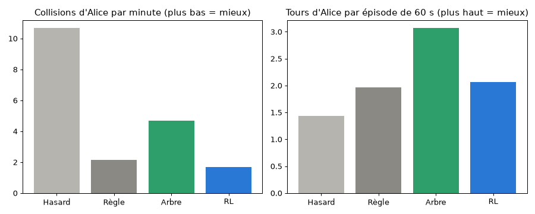

# Expérience Alice : du Machine Learning sur UNE seule voiture

> Objectif : **comprendre** le ML en voyant une différence de comportement.
> Alice (voiture n°0) change de conduite, les autres gardent la Règle. On compare.

## 0. Lancer (dans l'ordre)

```bash
.venv/bin/python -m pip install -r requirements.txt   # ajoute scikit-learn
.venv/bin/python tree_model.py      # 1. collecte + entraîne l'arbre (~25 s)
.venv/bin/python alice.py           # 2. entraîne le RL d'Alice + compare les 4 conduites (~30 s)
.venv/bin/python main.py            # 3. regarde Alice rouler (contour noir, « Alice* »)
```

Dans `main.py` : `ALICE = "rl"`, `"tree"` ou `None`.

---

## 1. Le vocabulaire (à savoir par cœur)

| Mot | Sens simple | Dans notre projet |
|---|---|---|
| **Modèle** | une « fonction » qui a appris à partir d'exemples | l'arbre, ou la table Q |
| **Feature** (X) | une information donnée au modèle | « la sortie tout droit est dangereuse ? » |
| **Label** (y) | la bonne réponse, connue pour les exemples | « collision : oui (1) / non (0) » |
| **Entraîner** | le modèle règle ses paramètres sur les exemples | `model.fit(X, y)` |
| **Prédire** | le modèle répond sur un cas nouveau | `model.predict_proba(X)` |
| **Jeu de test** | exemples cachés pendant l'entraînement, pour noter le modèle | 20 % des décisions |
| **Surapprentissage** | le modèle apprend par cœur, marche mal sur du neuf | on limite la profondeur à 4 |
| **Politique** | règle qui dit quoi faire dans chaque situation | `choose()` → (sortie, allure) |

## 2. Deux familles de ML

| | **Supervisé** (arbre) | **Par renforcement** (RL, Q-learning) |
|---|---|---|
| Analogie | apprendre avec un livre de corrigés | apprendre à faire du vélo en tombant |
| A besoin de | exemples + bonnes réponses | un environnement + des récompenses |
| Apprend | « cette action est-elle risquée **maintenant** ? » | « cette action rapporte quoi **au total**, futur compris ? » |
| Fichier | `tree_model.py` | `learning.py` (agent) + `alice.py` (entraînement Alice) |

---

## 3. Ce que « voit » Alice (les features)

À chaque node, avant de choisir, Alice regarde (fonction `get_state` de `learning.py`) :

| Feature | Valeurs | Sens |
|---|---|---|
| `descendre`, `tout_droit`, `monter` | 0 pas de sortie · 1 libre · 2 occupée (loin) · 3 **danger** | l'état de chaque sortie |
| `rapide` | 0 / 1 | Alice roule plus vite que la moyenne ? |
| `derriere` | 0 / 1 | quelqu'un arrive juste derrière elle ? |
| `direction` | 0 descendre · 1 tout droit · 2 monter | ce qu'elle **choisit** |
| `allure` | 0 lent · 1 normal · 2 rapide | ce qu'elle **choisit** |

Exemple de ligne dans `data/decisions.csv` :
```
descendre,tout_droit,monter,rapide,derriere,direction,allure,collision
1,3,0,1,0,1,2,1
```
→ « descendre libre, tout droit DANGER, pas de montée, je suis rapide, personne derrière ; j'ai pris **tout droit en rapide** → **collision** ». Logique.

---

## 4. Supervisé : l'arbre de décision (`tree_model.py`)

### Étape 1 : collecter
`RecorderPolicy` fait conduire tout le monde **au hasard** (pour voir toutes les situations) et note chaque décision :
- à la décision : on ouvre une ligne avec label 0 ;
- si une collision arrive avant la décision suivante : label → 1 ;
- à la décision suivante : la ligne est rangée.

150 circuits × 60 s → **~97 000 décisions**, dont **~14 % de collisions**.

### Étape 2 : entraîner
```python
x_train, x_test, y_train, y_test = train_test_split(x, y, test_size=0.2, stratify=y)
model = DecisionTreeClassifier(max_depth=4, class_weight="balanced")
model.fit(x_train, y_train)
```
- **`train_test_split`** : 80 % pour apprendre, 20 % cachés pour noter.
- **`max_depth=4`** : 4 questions max → l'arbre reste lisible (`docs/images/arbre.png`, `docs/arbre.txt`).
- **`class_weight="balanced"`** : voir piège n°1.

Un arbre, c'est une suite de questions. Extrait de `docs/arbre.txt` :
```
|--- derriere <= 0.50                  (personne derrière ?)
|   |--- tout_droit <= 1.50            (tout droit libre ou absent ?)
|   |   |--- monter <= 1.50
|   |   |   |--- descendre <= 1.50  -> class: 0   (tout est libre : OK)
```

### Étape 3 : utiliser (`TreePolicy`)
Pour chaque action possible (≤ 9), l'arbre donne une **probabilité de collision**. Alice prend l'action au plus petit `risque + petit malus si lent` (sinon elle roulerait lentement partout).

### Les résultats (lancer `tree_model.py` pour les voir)
| Mesure | Valeur | Lecture |
|---|---|---|
| Précision modèle « bête » (répond toujours « pas de collision ») | 85,5 % | le piège ! |
| Précision de l'arbre | 75,5 % | plus bas… |
| Collisions détectées (rappel) | 76,5 % | …mais il repère 3 collisions sur 4, le « bête » 0 |
| Précision sur l'entraînement | 75,8 % | ≈ test → **pas de surapprentissage** |

### ⚠️ Piège n°1 : la précision ment quand une classe est rare
86 % des décisions sont sans collision. Un modèle qui dit toujours « pas de collision » a 86 % de précision… et ne sert à rien. C'est pour ça qu'on regarde le **rappel** (part des collisions détectées) et qu'on met `class_weight="balanced"` (une erreur sur une collision coûte plus cher).

---

## 5. Renforcement : le Q-learning d'Alice (`alice.py`)

Pas d'exemples : Alice **essaie**, reçoit des **récompenses**, et retient.

| Événement | Récompense |
|---|---|
| collision | −10 |
| fin d'un cadre | +1 |
| chaque seconde de route | −0,1 (sinon rouler lentement serait gratuit) |

Elle tient une table `q[état][action]` = « combien ça rapporte ». Après chaque segment :
```
q = q + 0.1 × (récompense + 0.9 × meilleur q de la situation suivante − q)
         ↑ ALPHA : vitesse d'apprentissage      ↑ GAMMA : poids du futur
```
**Exploration** : au début Alice choisit au hasard (epsilon = 1), puis de moins en moins (epsilon → 0,05). Sans exploration, elle ne découvrirait jamais les bonnes actions.

800 épisodes (~20 s). Seule Alice apprend, les 9 autres roulent à la Règle. Table → `q_alice.json` (lisible).

---

## 6. La comparaison (30 circuits jamais vus)



| Conduite d'Alice | Collisions d'Alice / min | Tours / 60 s | Collisions des autres / min |
|---|---:|---:|---:|
| Hasard | 10,67 | 1,43 | 3,61 |
| Règle | 2,13 | 1,97 | 2,70 |
| Arbre (supervisé) | 4,70 | **3,07** | 2,97 |
| RL (Q-learning) | **1,70** | 2,07 | **2,64** |

### Lecture
- **Le ML marche** : Arbre et RL font bien mieux que le Hasard (10,67 → 4,70 et 1,70).
- **RL = le plus sûr** : −20 % de collisions par rapport à la Règle, un peu plus de tours, et Alice gêne moins les autres.
- **Arbre = le plus rapide mais pas le plus sûr** : 3 tours au lieu de 2, mais 2× plus de collisions que la Règle.

### ⚠️ Piège n°2 : pourquoi l'arbre fait moins bien que le RL ?
1. **Il ne voit que l'instant présent.** Il prédit « collision sur CE segment ? ». Le RL, avec GAMMA, compte aussi ce qui arrive après.
2. **Il a appris dans un autre monde** (*distribution shift*) : les données viennent de voitures **toutes au hasard**, mais Alice roule au milieu de voitures **à la Règle**. Les situations ne sont pas les mêmes.
3. **Le malus de lenteur** pousse l'arbre à rouler vite → plus de tours, plus de risques.

Pistes (exercices) : collecter avec les autres à la Règle ; ajouter une feature ; changer `SLOW_PENALTY` ; changer `max_depth` et regarder précision entraînement vs test.

### ⚠️ Piège n°3 : toujours comparer à conditions égales
Mêmes 30 circuits (seeds 0-29), jamais utilisés pour apprendre (entraînement sur seeds ≥ 10 000), même trafic autour d'Alice. Sinon la différence pourrait venir du hasard, pas du modèle.

---

## 7. Qui fait quoi dans le code

| Fichier | Rôle |
|---|---|
| `traffic.py` | `Traffic(..., special={0: conduite})` : Alice a sa conduite, `policy_of(v)` choisit la bonne |
| `learning.py` | `get_state` (features), `QAgent` (RL), inchangés |
| `tree_model.py` | collecte (`RecorderPolicy`), entraînement (`train`), conduite (`TreePolicy`) |
| `alice.py` | RL d'Alice (`train_alice`), comparaison (`measure`), graphique |
| `display.py` / `main.py` | `ALICE = "rl"/"tree"/None`, Alice en contour noir, `Alice*` dans le classement |
| `test_alice.py` | 8 tests : conduite spéciale, exemples bien formés, arbre > hasard, RL apprend, mesure reproductible |

## 8. Questions d'oral probables
- *Différence supervisé / renforcement ?* → corrigés vs essais-récompenses (tableau §2).
- *Pourquoi une seule voiture ?* → pour isoler l'effet de la conduite (§6, piège 3).
- *Pourquoi l'arbre a 75 % et le modèle bête 86 % ?* → classe rare, regarder le rappel (§4, piège 1).
- *Pourquoi le RL gagne ?* → il pense au futur (GAMMA) et apprend dans le vrai trafic (§6, piège 2).
- *Surapprentissage ?* → précision entraînement ≈ test, profondeur limitée à 4.
