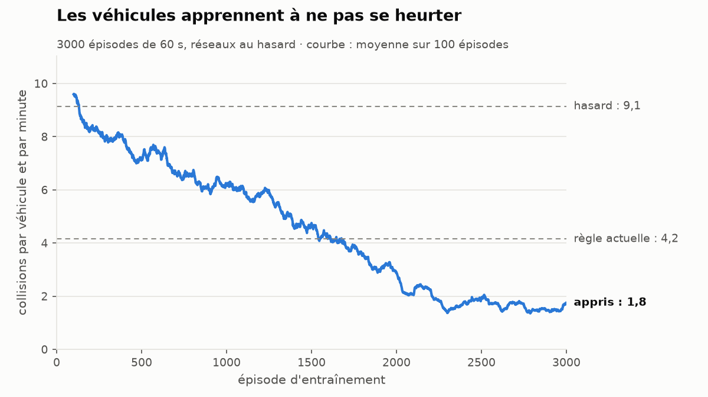
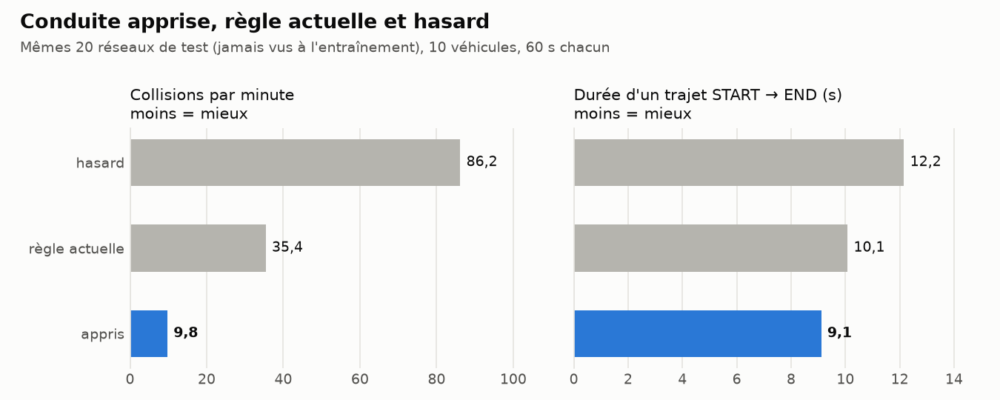

# Tickets ML – des véhicules qui apprennent à éviter les collisions

Objectif : les véhicules apprennent (Q-learning) à choisir leur sortie et leur allure pour ne pas se heurter.
On compare trois conduites sur les mêmes réseaux : **hasard**, **règle actuelle** (divergence 2 s) et **appris**.

## Choix de conception

- **Collision = événement, pas blocage.** Les véhicules se traversent (fantômes) : on compte la collision, on l'affiche, on punit l'agent. Si on les bloquait physiquement, plus rien à apprendre.
- **Action = (sortie, allure)**, avec allure ∈ {slow ×0.5, normal ×1, fast ×1.5} → au plus 3 × 3 = 9 actions. Pas d'action « attendre sur place » : un véhicule arrêté sur un node se ferait percuter par celui de derrière.
- **Un seul cerveau partagé** par tous les véhicules : une table Q en JSON. Une table pré-entraînée est versionnée pour que la démo marche sans entraîner.
- **La règle actuelle reste la conduite par défaut** : `check.py` et les tests existants ne changent pas.
- **Aucune nouvelle dépendance** : Python pur + matplotlib.

## Suivi

| Ticket | Titre | Taille | Dépend de | Statut |
|---|---|---|---|---|
| ML-1 | Vitesse propre à chaque véhicule | S | – | ✅ fait |
| ML-2 | Détection des collisions | M | ML-1 | ✅ fait |
| ML-3 | Politiques de conduite interchangeables | M | ML-1 | ✅ fait |
| ML-4 | Collisions visibles à l'écran | S | ML-2 | ✅ fait |
| ML-5 | Ce que « voit » un véhicule (état) | M | ML-2, ML-3 | ✅ fait |
| ML-6 | Agent Q-learning | L | ML-5 | ✅ fait |
| ML-7 | Entraînement sans fenêtre | M | ML-6 | ✅ fait |
| ML-8 | Comparer hasard / règle / appris | S | ML-7 | ✅ fait |
| ML-9 | Choisir la conduite dans la fenêtre | M | ML-4, ML-6 | ✅ fait |
| ML-10 | QA + documentation | M | tous | ✅ fait |

```
ML-1 → ML-2 → ML-4
    ↘ ML-3 ↗
ML-2 + ML-3 → ML-5 → ML-6 → ML-7 → ML-8
                            ML-6 + ML-4 → ML-9 → ML-10
```

Parallélisables : ML-3 et ML-4, ML-8 et ML-9. Ticket le plus risqué : **ML-6** (le choix des récompenses décide si ça apprend) → prévoir d'itérer avec ML-7.

---

## ML-1 · Vitesse propre à chaque véhicule (`traffic.py`) · S

**Pourquoi :** tous à la même vitesse, personne ne rattrape personne → aucune collision possible, rien à apprendre.

**À faire**
- `Vehicle.base_speed` tirée au hasard entre `MIN_SPEED_FACTOR` et `MAX_SPEED_FACTOR` × `SPEED` (0,7 à 1,3).
- Tirage avec un hasard **séparé** de celui des sorties (`random.Random(f"{seed}-speeds")`), pour ne pas changer les choix de sortie d'une seed existante.
- `Vehicle.speed` (vitesse du segment en cours) ; `update()` l'utilise au lieu de `SPEED`. Pour l'instant `speed = base_speed` ; l'allure arrive en ML-3.

**Fait quand**
- Même seed = mêmes vitesses (test).
- Vitesses dans l'intervalle, et pas toutes égales (test).
- Un véhicule avance de `speed × dt` (test).
- `./run_checks.sh` passe.

## ML-2 · Détection des collisions (`traffic.py`) · M

**Dépend de :** ML-1

**À faire**
- Collision si :
  - deux véhicules sur le même segment avec un écart de `progress` < `MIN_GAP` (ex. 0,15), **ou** dont l'ordre s'est inversé depuis l'image précédente (dépassement impossible sur une voie) ;
  - deux véhicules à moins de `MIN_GAP` du même node (fusion de deux routes).
- START et END exclus (départ et retour des véhicules).
- **Une collision par contact**, pas une par image : mémoriser les paires déjà en contact.
- `traffic.collisions` (compteur) et `traffic.collision_events` (instant, véhicule A, véhicule B, lieu).
- Regrouper les véhicules par segment / node (dict) plutôt que comparer toutes les paires : l'entraînement doit rester rapide.

**Fait quand** (tests sur un mini-réseau construit à la main)
- Un rapide derrière un lent → 1 collision.
- Deux véhicules éloignés → 0.
- Un contact qui dure plusieurs images → 1 seule collision.

## ML-3 · Politiques de conduite interchangeables (`policies.py`, `traffic.py`) · M

**Dépend de :** ML-1

**À faire**
- Interface : `choose(traffic, vehicle, node, exits) -> (sortie, allure)`.
- `PACES = {"slow": 0.5, "normal": 1.0, "fast": 1.5}` ; à chaque segment, `vehicle.speed = base_speed × allure`.
- `RulePolicy` : le code actuel de `choose_exit`, déplacé tel quel, allure normale.
- `RandomPolicy` : sortie et allure au hasard.
- `Traffic(network, count, seed, policy=None)` : `None` = `RulePolicy`.
- Garder `decisions` et `forced_divergences` pour `check_divergence`.

**Fait quand**
- Tous les tests existants passent sans modification.

## ML-4 · Collisions visibles à l'écran (`display.py`) · S

**Dépend de :** ML-2

**À faire**
- Compteur de collisions dans la ligne d'info.
- Croix / halo rouge ~0,5 s au lieu d'une collision.
- L'artiste doit être `animated=True` et dessiné dans `draw_moving_parts`, sinon le blitting casse.

**Fait quand**
- On voit des collisions en mode hasard, sans perte de fluidité.

## ML-5 · Ce que « voit » un véhicule (`learning.py`) · M

**Dépend de :** ML-2, ML-3

**À faire**
- `get_state(traffic, vehicle, node, exits) -> tuple`, une case par direction (descendre / tout droit / monter) :
  - `0` pas de sortie ;
  - `1` libre ;
  - `2` véhicule devant, loin ;
  - `3` danger : véhicule devant à moins de `CLOSE_GAP` (0,4), ou un autre véhicule arrive au même node à moins de `MERGE_WINDOW` (0,3 s) de nous, à allure normale.
- \+ une case pour la vitesse propre : lente / rapide par rapport à la moyenne.
- \+ une case **derrière** (ajoutée en cours de ticket) : un véhicule arrive juste derrière (< `BEHIND_GAP`, 0,3). Sans elle, l'agent ne peut pas savoir qu'aller lentement le fera percuter.
- 4³ × 2 × 2 = 256 états : table petite, apprentissage rapide.

**Fait quand**
- Tests sur des situations construites à la main (sortie libre, véhicule devant, fusion).

**Résultat** (200 réseaux, 12 véhicules au hasard, 60 s) : l'état annonce bien les collisions.

| Ce que voyait le véhicule | Collision sur le segment choisi |
|---|---:|
| sortie libre | 13 % |
| sortie occupée | 32 % |
| sortie danger | 56 % |
| véhicule derrière + allure lente | 64 % |
| véhicule derrière + allure rapide | 41 % |

232 états sur 256 rencontrés.

## ML-6 · Agent Q-learning (`learning.py`) · L

**Dépend de :** ML-5

**À faire**
- `QAgent` : table `dict[état] -> 9 valeurs`, choix ε-greedy, mise à jour `Q += α (r + γ · max Q' − Q)`.
- Récompenses :
  - −10 par collision (aux deux véhicules) ;
  - +1 à l'arrivée au END ;
  - −0,1 × durée du segment (sinon « toujours lent » est gratuit).
- Chaque véhicule garde `(dernier état, dernière action, récompense cumulée)` ; mise à jour à sa décision suivante, ou à l'arrivée au END (état final).
- `Traffic` prévient la politique : `on_collision`, `on_arrival` (classe de base `Policy` dans `policies.py` : ne font rien pour la règle et le hasard).
- `save(path)` / `load(path)` en JSON (clés en chaîne : JSON n'accepte pas les tuples).
- Conduite apprise : `QAgent.load(path)` renvoie un agent qui prend toujours la meilleure action et n'apprend plus (pas besoin d'une classe `LearnedPolicy` à part).
- `forget()` : oublie les trajets en cours entre deux épisodes d'entraînement.

**Fait quand**
- Test d'une mise à jour Q calculée à la main.
- `save` puis `load` redonne la même table.

**Résultat** (essai rapide, 1000 épisodes d'entraînement en 8,5 s ; évaluation sur les 20 réseaux de référence, jamais vus à l'entraînement, 10 véhicules, 60 s)

| Conduite | Collisions / min | Arrivées au END / min |
|---|---:|---:|
| hasard | 86,2 | 41,0 |
| règle | 35,4 | 50,8 |
| **appris** | **5,8** | 46,6 |

Pendant l'entraînement, les collisions par véhicule et par minute passent de 9,0 à ~1,5. Ce que l'agent a appris :
- allures variées (normale 53 %, rapide 28 %, lente 18 %) : il n'a pas triché en roulant toujours lentement ;
- une sortie en danger et une autre non → il évite le danger 124 fois sur 125 ;
- un véhicule le suit de près → presque jamais lent (4 fois sur 138).

## ML-7 · Entraînement sans fenêtre (`train.py`) · M

**Dépend de :** ML-6

**À faire**
- N épisodes ; chacun : réseau au hasard (seed, routes, intersections), 6 à 15 véhicules, 60 s simulées à `dt = 0.1` fixe.
- ε décroît de 1 à 0,05.
- Produit `q_table.json` et `docs/images/apprentissage.png` (collisions par épisode, moyenne glissante).
- Seed d'entraînement fixe : résultat reproductible.

**Fait quand**
- Moins de 2 min d'entraînement, courbe nettement descendante.

**Résultat**
- `python train.py` : 3000 épisodes en ~30 s (`python train.py 500` pour un essai court). Deux lancements donnent une table identique à l'octet près.
- Réseaux d'entraînement : seeds ≥ 10 000 ; les seeds 0 à 9999 restent pour l'évaluation.
- Pourquoi 3000 épisodes : plus on entraîne, plus l'agent échange un peu de sécurité contre du débit (le coût du temps pèse davantage). 3000 est le meilleur compromis mesuré :

  | Épisodes | Collisions / min | Arrivées / min |
  |---:|---:|---:|
  | 1000 | 5,8 | 46,6 |
  | 3000 | 8,0 | 51,2 |
  | 6000 | 12,7 | 52,4 |
  | *règle* | *35,4* | *50,8* |

- Table livrée (`q_table.json`, 249 états, une ligne par état) : **9,8 collisions/min, 57,0 arrivées/min** sur les 20 réseaux de référence (règle : 35,4 et 50,8).
- Courbe : 

## ML-8 · Comparer hasard / règle / appris (`evaluate.py`) · S

**Dépend de :** ML-7

**À faire**
- Les 3 politiques sur les **mêmes** 20 seeds de test, jamais vues à l'entraînement.
- Mesures : collisions / minute, temps moyen d'un trajet START → END.
- Tableau dans le terminal + `docs/images/comparaison.png` (barres).

**Fait quand**
- L'appris fait moins de collisions que le hasard. S'il ne bat pas la règle, on le dit honnêtement dans la doc.

**Résultat**
- Fichier séparé `evaluate.py` plutôt que `train.py --compare` : comparer prend ~0,5 s, pas besoin de réentraîner (30 s) pour ça. `simulate()` de `train.py` est réutilisé.
- `Traffic.trip_times` : durée de chaque trajet START → END terminé.
- Réseaux de test : seeds 0 à 19, 4 routes, 4 intersections, 10 véhicules, 60 s.

  | Conduite | Collisions / min | Trajet moyen (s) | Arrivées / min |
  |---|---:|---:|---:|
  | hasard | 86,2 | 12,2 | 41,0 |
  | règle actuelle | 35,4 | 10,1 | 50,8 |
  | **appris** | **9,8** | **9,1** | **57,0** |

- L'appris fait moins de collisions que la règle sur **20/20 réseaux**, et ses trajets sont **plus courts** : il gagne sur les deux tableaux, sans compromis.
- Un test protège la table livrée : si un réentraînement fait moins bien que la règle, `pytest` échoue.
- Graphique : 

## ML-9 · Choisir la conduite dans la fenêtre (`display.py`, `main.py`) · M

**Dépend de :** ML-4, ML-6

**À faire**
- Boutons radio `Hasard / Règle / Appris` : relance la circulation sur le même réseau.
- `DRIVING = "rule"` dans `main.py`.
- **Filet de sécurité** : `q_table.json` absent ou corrompu → retour à « Règle » + message, jamais de crash.

**Fait quand**
- Tests : fichier absent, fichier corrompu.
- Les 3 modes s'affichent.

**Résultat**
- Boutons « Conduite : Hasard / Règle / Appris » en bas à droite, sous la légende. Changer relance la circulation sur le même réseau ; la ligne d'info indique la conduite (et les divergences seulement pour la règle).
- `make_policy(nom)` dans `learning.py` : la conduite à partir de son nom, avec le filet de sécurité. `QAgent.load()` vérifie maintenant le fichier (objet JSON, états de 5 cases, 9 nombres par ligne) et lève `ValueError` sinon.
- Table absente ou abîmée → conduite Règle, bouton recoché sur « Règle », message sous la ligne d'info : « Table apprise absente ou abîmée (lancer train.py) : conduite Règle. »
- `DRIVING` inconnu dans `main.py` (faute de frappe) → message clair dans le terminal, conduite Règle.
- Tests : les 3 noms, table absente, 7 façons d'abîmer le fichier (vide, pas du JSON, pas un objet, état trop court, état pas en nombres, pas 9 valeurs, valeur pas un nombre).
- Vérifié sans écran : 3 clics → `RandomPolicy`, `RulePolicy`, `QAgent` ; clic sur « Appris » sans table → règle + message.

## ML-10 · QA + documentation · M

**Dépend de :** tous

**À faire**
- Tests de chaque ticket dans `test_roadnetwork.py` ; `test_learning.py` ajouté au `testpaths` de `pyproject.toml`.
- `check.py` : balayage des collisions en mode règle sur les 120 réseaux, sans crash.
- `./run_checks.sh` passe (ruff + pytest + check).
- README (section « Apprentissage » + les 2 images), `docs/features.md` (F17 → F26), `docs/architecture.md` (`policies.py`, `learning.py`, `train.py`), une slide : Q-learning en une phrase + la courbe.

**Résultat**
- `check.py` va plus loin que prévu : sur chacun des 120 réseaux, les **3 conduites** (pas seulement la règle) roulent 20 s ; il vérifie que le compteur de collisions correspond aux événements, que chaque trajet dure plus de 0 s, et qu'aucun véhicule ne sort des routes. ~39 000 collisions et ~25 000 trajets contrôlés en 0,8 s. Vérifié qu'il attrape un bug injecté (véhicule envoyé hors des routes).
- Même balayage dans pytest (4 tailles × 5 seeds) : **137 tests**, `./run_checks.sh` passe.
- Docstrings : toutes les classes et fonctions en ont une (sauf `__init__` / `__repr__`, décrits par leur classe, comme dans le reste du projet).
- README : section « Apprentissage (ML) » (4 idées, entraînement, résultats, 2 graphiques, limites).
- `docs/features.md` : F14 → F26 ajoutées au tableau, section « Round 6 – Apprentissage » (F17 = ML-1 … F26 = ML-10).
- `docs/architecture.md` : 8 choix ML justifiés (et ce qu'on a écarté), « pas de bibliothèque de ML ».
- `docs/presentation.md` : slide 8c, étape 6 de la démo, 5 questions probables sur l'apprentissage, `q_table.json` dans la checklist du ZIP.
- Tous les liens locaux des fichiers Markdown pointent vers des fichiers existants.
